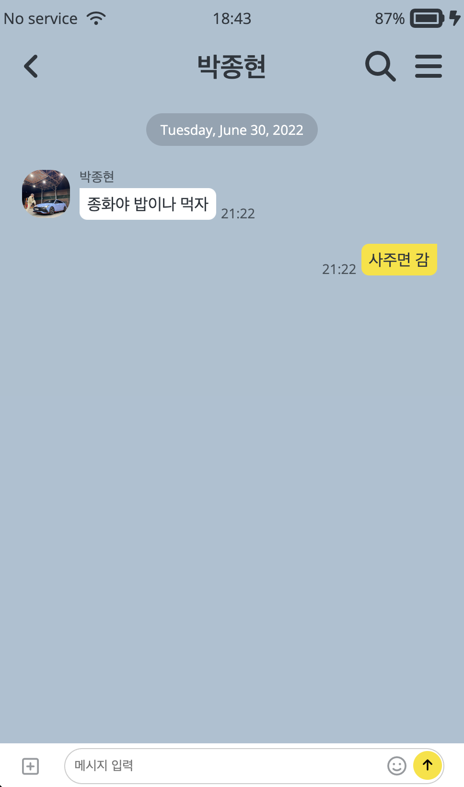
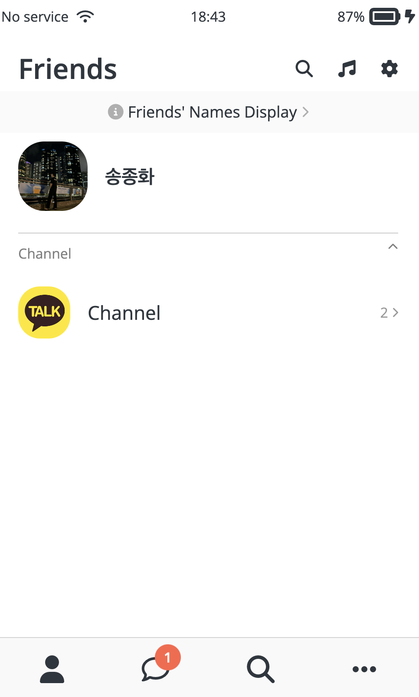
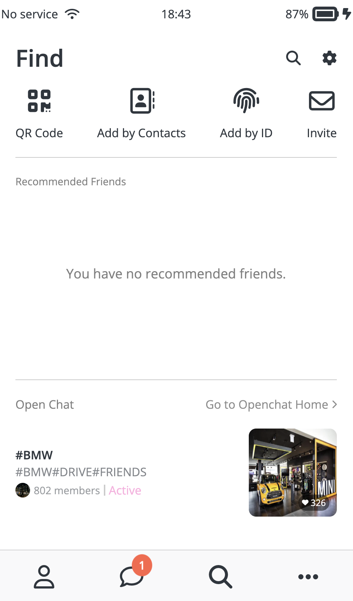

# Kakao-Clone

## 🔗 Demo
https://jonghwa3471.github.io/study-html-kakao-clone/

## 🖥 Preview
  

## 🔥 Stack

### Front-end

 

### Deploy

## ✅ Packages

- [x] HTML5
- [x] CSS3
- [x] VSCode
- [x] GitHub

## 📖 Theory

- [x] HTML Tags
- [x] IDs & Classes
- [x] Semantic & Non-Semantic tags
- [x] Box Model
- [x] Inline, Block, Inline-block
- [x] CSS Position
- [x] Flexbox
- [x] Selectors
- [x] Pseudo Selectors
- [x] Transitions
- [x] Animations
- [x] Media Queries

## 📱 View

- [x] Status Bar
- [x] Chat
- [x] Find
- [x] Friends
- [x] Settings
- [x] Message Animations
